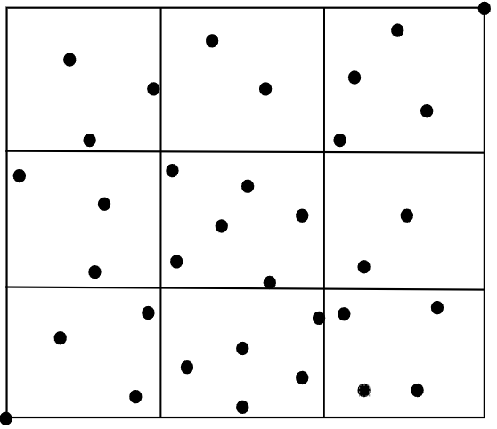
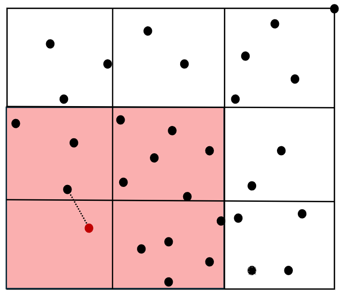

## My Requirements:
- Format of data given to find_nearest_fast() must match example given
    - This implies 2 dimensional data
-  answer must be exact, not approximate
- Not a K-D tree or other common algorithm

## The Solution

Upon class initialization, a spatial grid index is constructed, organizing each point into its corresponding grid cell based on its coordinates. The number of grid cells is specified when calling the class but can be left blank with a default 20x20 grid.

When searching for the nearest neighbor, the process begins by checking the grid cell that contains the query point. If no neighbor is found, the search expands outward to neighboring cells in order of proximity to the query point. Once a potential neighbor is identified, the Euclidean distance between the query point and this neighbor is calculated. The search then continues, examining only cells that could contain a neighbor with a shorter distance than the current closest neighbor. This ensures an efficient search by limiting unnecessary checking other points.

## Advantages
- Large speed improvement for large, somwhat evenly distributed datasets

## Disadvantages
- Worst case can be as innefficient as brute force
- Slow to create grid index, must iterate through all points once

## Potential Improvements
- Caching system for already generated nearest neighbors
- Function to optomize the size of the grid based on number of points
- More efficient algirithm to seach grid cells
- Multiprocessing to process cells in parallel